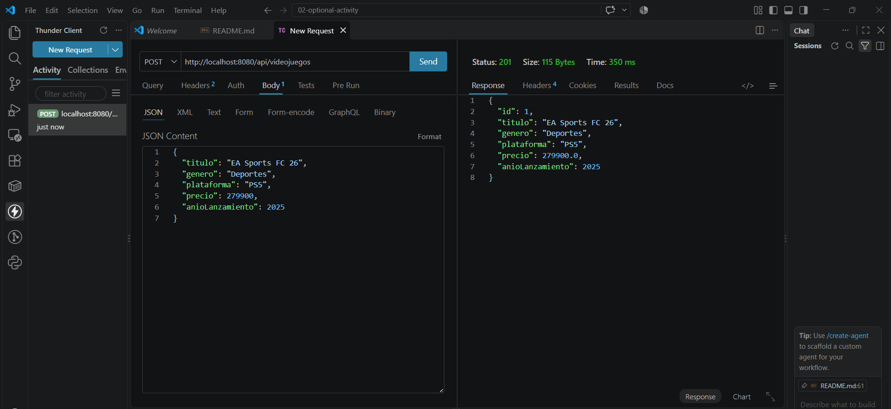
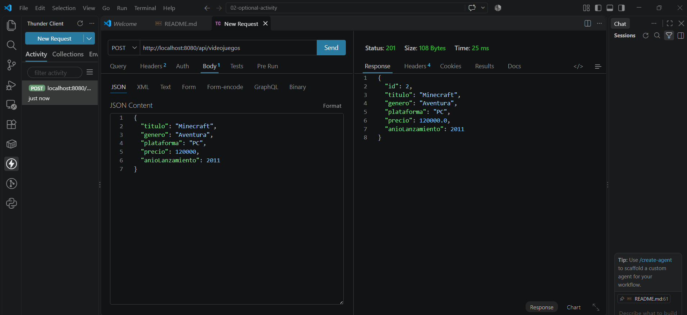
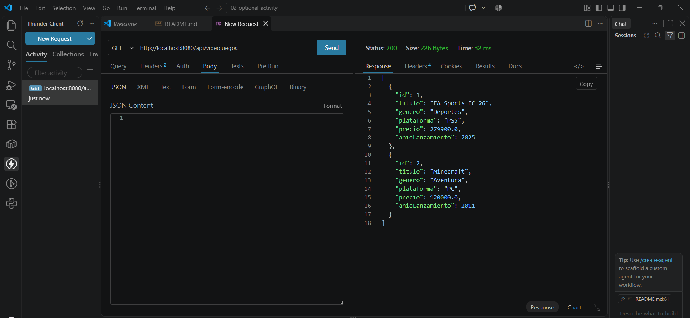
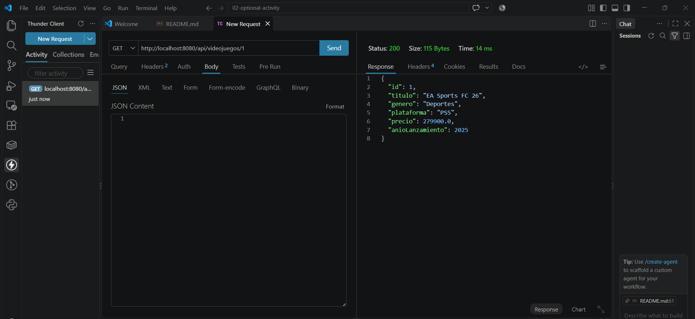
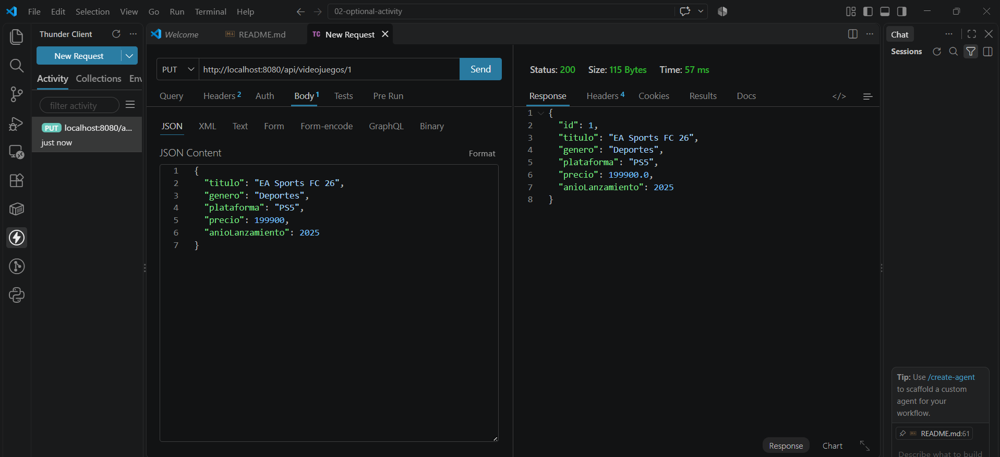
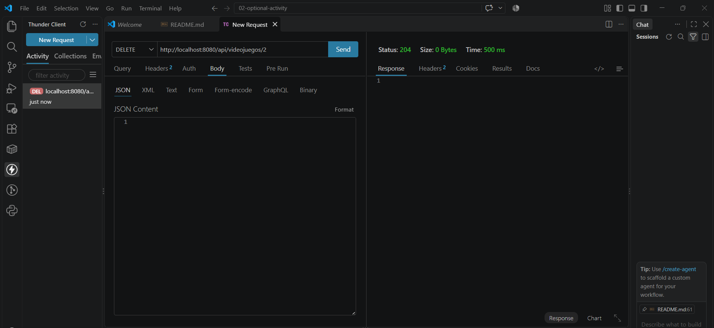
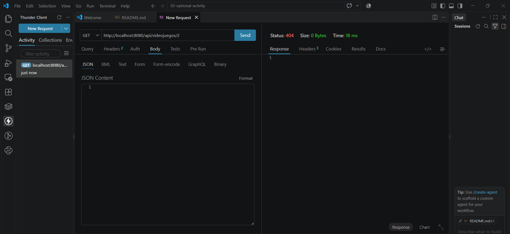

# Semana 8 · CRUD REST — Catálogo de Videojuegos

En esta semana el catálogo de videojuegos que venía trabajando se convirtió en una API REST completa. En la semana 6 diseñé la arquitectura en capas y en la semana 7 construí la entidad y el repositorio con JPA. Ahora agregué el controller, que expone las operaciones del CRUD como endpoints REST para que cualquier cliente (por ejemplo, un frontend) pueda crear, consultar, actualizar y borrar videojuegos por HTTP.

El proyecto está hecho con Spring Boot y usa una base de datos H2 en memoria.

## 1. Estructura del proyecto

```
videojuegos-api/
├── pom.xml
├── evidencias/                                  (capturas de las pruebas)
└── src/main/
    ├── java/com/corhuila/videojuegos/
    │   ├── VideojuegosApiApplication.java       (arranque de la aplicación)
    │   ├── model/Videojuego.java                (entity)
    │   ├── repository/VideojuegoRepository.java (repository)
    │   ├── service/VideojuegoService.java       (service)
    │   └── controller/VideojuegoController.java (controller)
    └── resources/application.properties         (configuración)
```

## 2. Las capas

Cada petición entra por el controller, pasa al service, que usa el repository, y este guarda o consulta la entidad en la base de datos. Cada capa tiene una sola responsabilidad:

- **Entity (`Videojuego`):** representa la tabla `videojuego`, con título, género, plataforma, precio y año de lanzamiento.
- **Repository (`VideojuegoRepository`):** extiende `JpaRepository`, así que ya trae los métodos para guardar, listar, buscar y borrar sin escribir SQL.
- **Service (`VideojuegoService`):** tiene la lógica de negocio. Por ejemplo, antes de actualizar o borrar un videojuego revisa que exista.
- **Controller (`VideojuegoController`):** recibe las peticiones HTTP, llama al service y devuelve la respuesta en JSON con el código de estado adecuado. Nunca accede directamente al repository.

## 3. Endpoints

Todos los endpoints están bajo el recurso `/api/videojuegos`. La URL usa un sustantivo en plural y la acción la indica el método HTTP.

| Método | URL | Acción | Respuesta |
|---|---|---|---|
| GET | `/api/videojuegos` | Listar todos los videojuegos | `200 OK` |
| GET | `/api/videojuegos/{id}` | Obtener un videojuego | `200 OK` o `404 Not Found` si no existe |
| POST | `/api/videojuegos` | Crear un videojuego | `201 Created` |
| PUT | `/api/videojuegos/{id}` | Actualizar un videojuego | `200 OK` o `404 Not Found` si no existe |
| DELETE | `/api/videojuegos/{id}` | Borrar un videojuego | `204 No Content` o `404 Not Found` si no existe |

Para crear o actualizar se envía un JSON como este:

```json
{
  "titulo": "EA Sports FC 26",
  "genero": "Deportes",
  "plataforma": "PS5",
  "precio": 279900,
  "anioLanzamiento": 2025
}
```

## 4. Cómo ejecutarlo

Se necesita Java 17 o superior y Maven. Desde la carpeta `videojuegos-api`:

```bash
mvn spring-boot:run
```

La API queda disponible en `http://localhost:8080/api/videojuegos`. Como la base de datos H2 es en memoria, no hay que instalar nada, pero los datos se reinician cada vez que se detiene la aplicación.

## 5. Pruebas

Probé los endpoints con Thunder Client (extensión de VS Code), siguiendo el ciclo completo del CRUD: primero creé dos videojuegos, los listé, consulté uno, lo actualicé, borré el otro y comprobé que ya no existía.

**1. Crear un videojuego** — `POST /api/videojuegos` responde `201 Created` y devuelve el videojuego con el `id` asignado.



**2. Crear un segundo videojuego** — `POST /api/videojuegos` responde `201 Created` con `id: 2`.



**3. Listar** — `GET /api/videojuegos` responde `200 OK` con los dos videojuegos registrados.



**4. Obtener uno** — `GET /api/videojuegos/1` responde `200 OK` con el videojuego 1.



**5. Actualizar** — `PUT /api/videojuegos/1` cambia el precio de 279900 a 199900 y responde `200 OK` con los datos actualizados.



**6. Borrar** — `DELETE /api/videojuegos/2` responde `204 No Content`, es decir, se borró y no devuelve contenido.



**7. Consultar el videojuego borrado** — `GET /api/videojuegos/2` responde `404 Not Found`, lo que confirma que el borrado funcionó.


