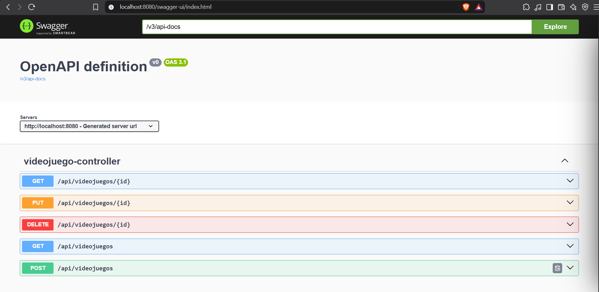
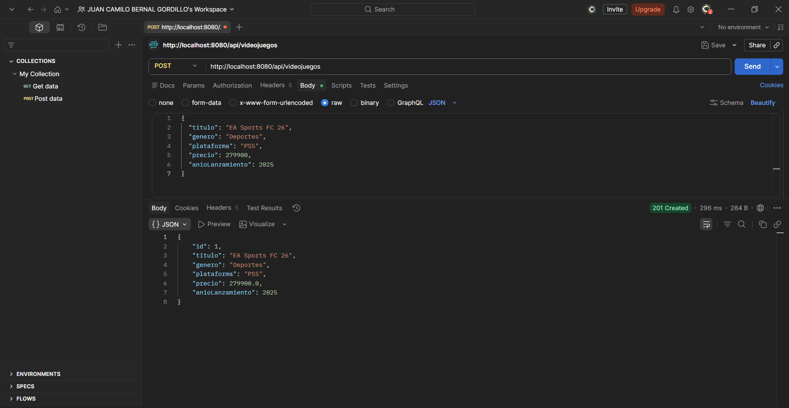
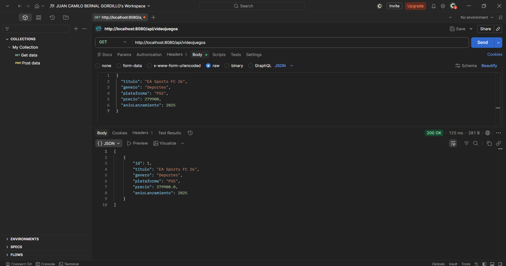
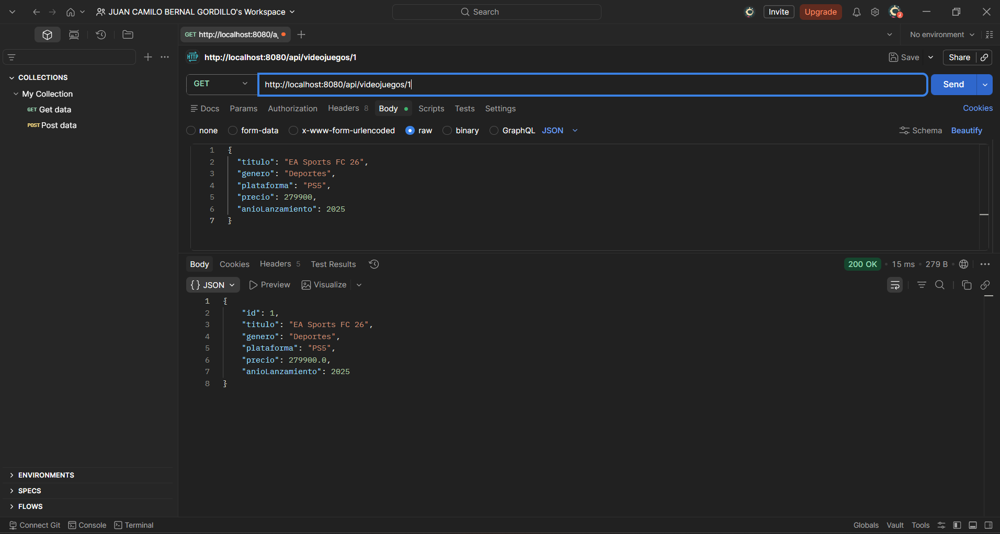
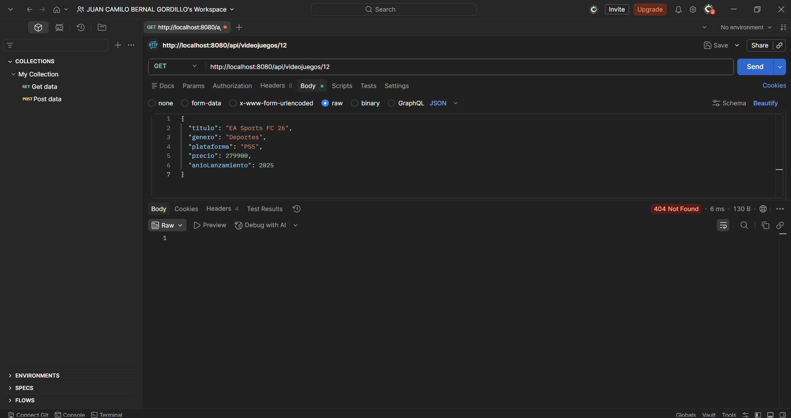

# Semana 9 · Documentar y probar la API — Catálogo de Videojuegos

Esta semana tomé la API REST del catálogo de videojuegos que construí en la semana 8 y le agregué dos cosas: documentación con Swagger (OpenAPI) y pruebas de los endpoints con Postman, incluyendo un caso de error. La idea es que cualquiera que vaya a consumir la API, por ejemplo un frontend, sepa qué endpoints hay, qué reciben y qué devuelven, y que esos endpoints estén comprobados antes de integrarlos.

El proyecto está hecho con Spring Boot y usa una base de datos H2 en memoria. El código de la API (entity, repository, service y controller) es el mismo de la semana 8.

## 1. Swagger

Para documentar la API agregué la dependencia de springdoc en el `pom.xml`:

```xml
<dependency>
    <groupId>org.springdoc</groupId>
    <artifactId>springdoc-openapi-starter-webmvc-ui</artifactId>
    <version>2.8.9</version>
</dependency>
```

No hizo falta escribir más código: al arrancar la aplicación, springdoc lee el controller y genera la documentación sola. Quedan disponibles dos direcciones:

- `http://localhost:8080/swagger-ui.html` — página interactiva con todos los endpoints, desde la que también se pueden probar.
- `http://localhost:8080/v3/api-docs` — la misma descripción de la API en formato JSON (el estándar OpenAPI).

En Swagger UI aparecen los cinco endpoints del recurso `/api/videojuegos` y el esquema de `Videojuego` con sus campos.



## 2. Cómo ejecutarlo

Se necesita Java 17 o superior y Maven. Desde la carpeta `videojuegos-api`:

```bash
mvn spring-boot:run
```

La API queda en `http://localhost:8080/api/videojuegos` y la documentación en `http://localhost:8080/swagger-ui.html`.

## 3. Pruebas con Postman

Probé tres endpoints y además un caso de error, en este orden:

**1. Crear un videojuego** — `POST http://localhost:8080/api/videojuegos` con este cuerpo en JSON:

```json
{
  "titulo": "EA Sports FC 26",
  "genero": "Deportes",
  "plataforma": "PS5",
  "precio": 279900,
  "anioLanzamiento": 2025
}
```

Responde `201 Created` y devuelve el videojuego con el `id` que se le asignó.



**2. Listar los videojuegos** — `GET http://localhost:8080/api/videojuegos` responde `200 OK` con la lista, donde aparece el videojuego que acabo de crear.



**3. Obtener un videojuego** — `GET http://localhost:8080/api/videojuegos/1` responde `200 OK` con los datos del videojuego 1.



**4. Caso de error: videojuego que no existe** — `GET http://localhost:8080/api/videojuegos/12` responde `404 Not Found` y sin cuerpo, porque no hay ningún videojuego con ese id.



## 4. Códigos de estado obtenidos

| Prueba | Petición | Código | Qué significa |
|---|---|---|---|
| Crear | `POST /api/videojuegos` | `201 Created` | La petición fue correcta y además se creó un recurso nuevo en el servidor. |
| Listar | `GET /api/videojuegos` | `200 OK` | La petición fue correcta y la respuesta trae lo que se pidió. |
| Obtener uno | `GET /api/videojuegos/1` | `200 OK` | El videojuego existe y se devuelve. |
| Error | `GET /api/videojuegos/12` | `404 Not Found` | La petición está bien formada, pero el recurso que se pide no existe. |

Los códigos que empiezan por 2 indican que todo salió bien, y los que empiezan por 4 indican un error del lado del cliente, es decir, de quien hace la petición. Por eso crear responde `201` y no un `200` genérico: le dice al cliente exactamente qué pasó. Y cuando se pide un id que no existe, la API responde `404` en lugar de un `200` vacío, para que un frontend pueda distinguir "no encontrado" de "encontrado" y mostrar el mensaje adecuado.
