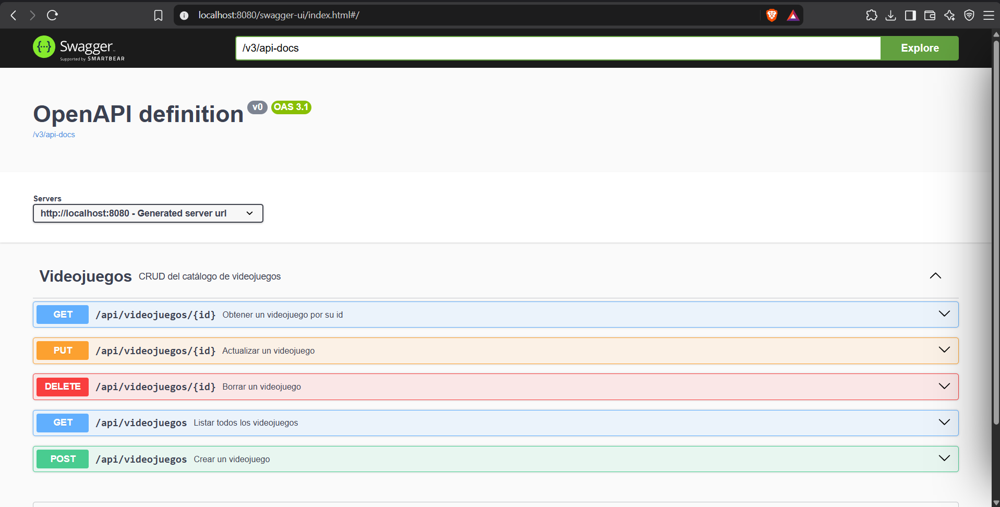
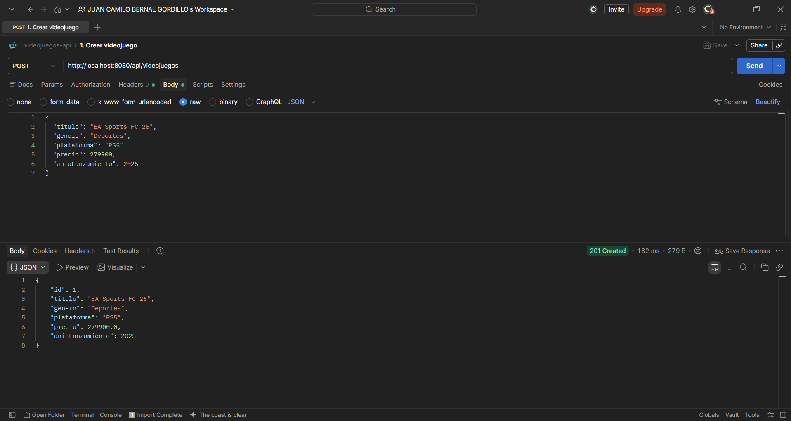
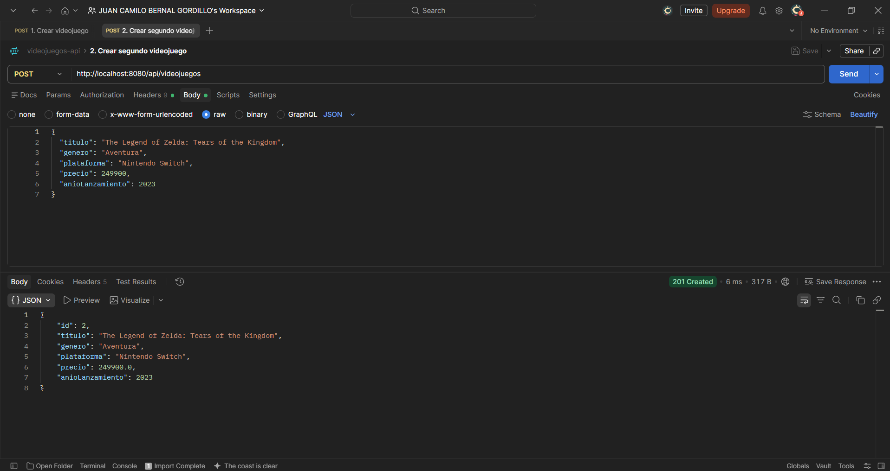
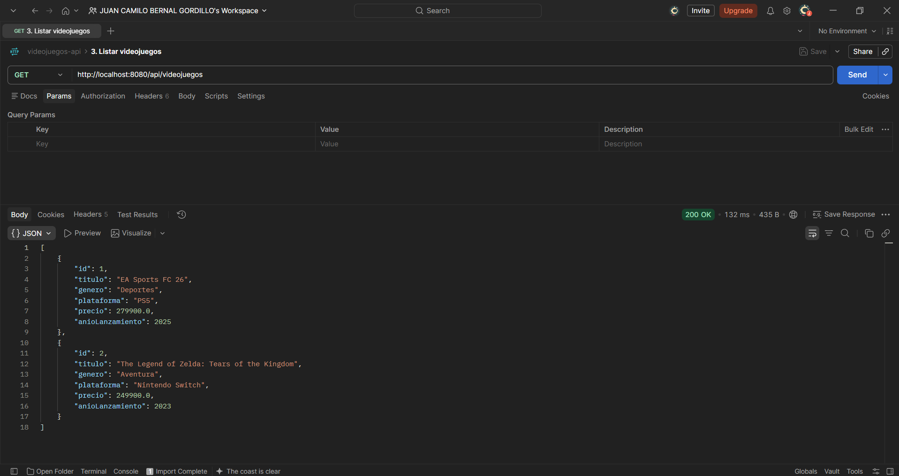
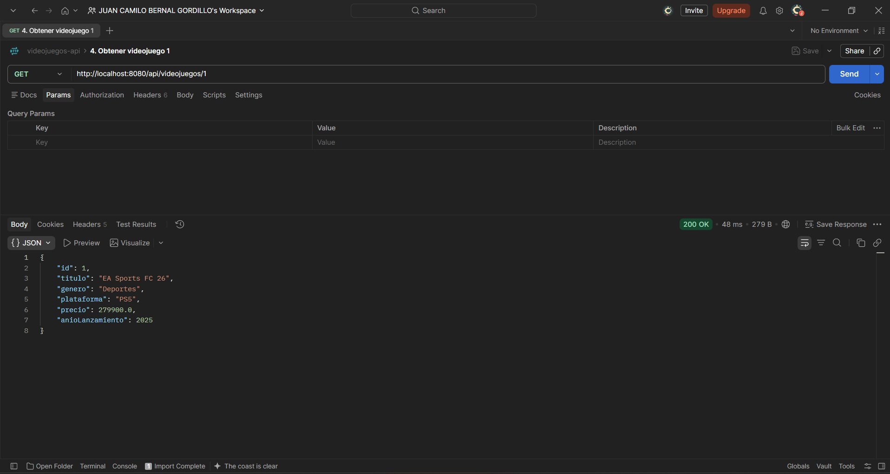
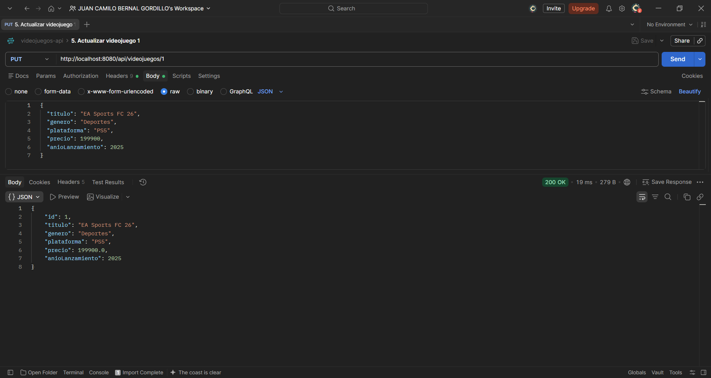
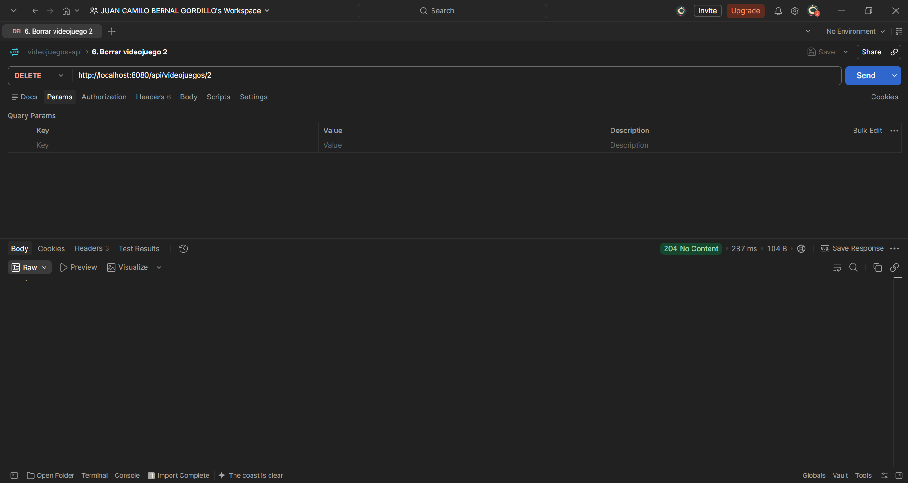
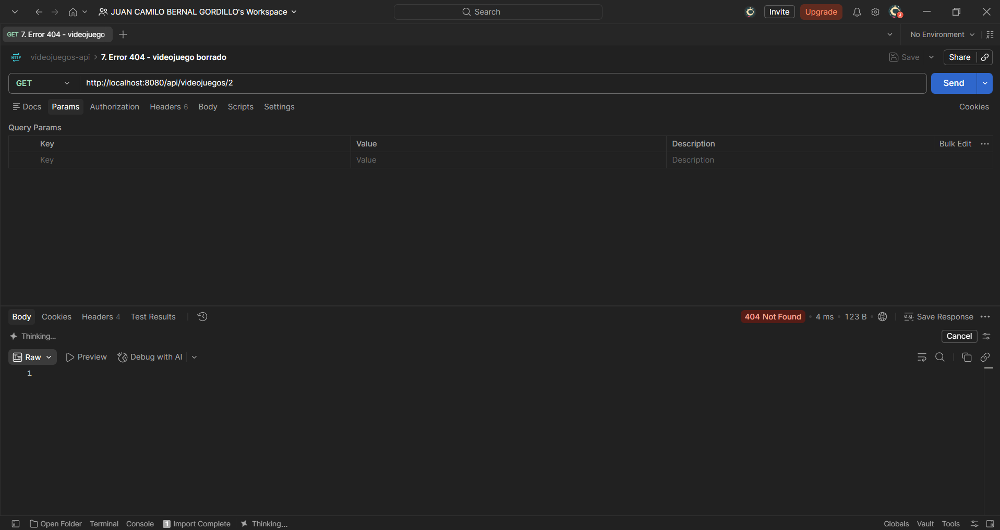

# Actividad calificable · Corte 2 — API REST del Catálogo de Videojuegos

| | |
| --- | --- |
| **Estudiante** | Juan Camilo Bernal Gordillo |
| **Materia** | Complementaria III - Profundización Desarrollo Fullstack (2026-B) |
| **Usuario de GitHub** | [JuanBernalCorhuila](https://github.com/JuanBernalCorhuila) |

Para esta actividad construí una API REST con Spring Boot que administra un catálogo de videojuegos. El recurso es `Videojuego` y la API permite listarlos, consultar uno, crearlos, actualizarlos y borrarlos. Los datos se guardan con JPA en una base de datos H2, la documentación se genera con Swagger y probé cada endpoint con Postman, incluyendo un caso de error.

## 1. Estructura del proyecto

```
c2-activity/
├── README.md
└── videojuegos-api/
    ├── pom.xml
    ├── evidencias/                                  (capturas de Swagger y Postman)
    ├── postman/
    │   └── videojuegos-api.postman_collection.json  (colección con las pruebas)
    └── src/main/
        ├── java/com/corhuila/videojuegos/
        │   ├── VideojuegosApiApplication.java       (arranque de la aplicación)
        │   ├── model/Videojuego.java                (entity)
        │   ├── repository/VideojuegoRepository.java (repository)
        │   ├── service/VideojuegoService.java       (service)
        │   └── controller/VideojuegoController.java (controller)
        └── resources/application.properties         (configuración)
```

Cada capa vive en su propio paquete y cada clase tiene una sola responsabilidad.

## 2. Las capas

Una petición entra por el controller, pasa al service, que usa el repository, y este guarda o consulta la entidad en la base de datos. El controller nunca habla directamente con el repository.

**Entity — `model/Videojuego.java`.** Representa la tabla `videojuego`. La anotación `@Entity` le dice a JPA que esta clase se guarda en la base de datos, y el `id` lo genera la base de datos automáticamente.

```java
@Entity
public class Videojuego {

    @Id
    @GeneratedValue
    private Long id;

    private String titulo;
    private String genero;
    private String plataforma;
    private double precio;
    private int anioLanzamiento;
    // constructores, getters y setters
}
```

**Repository — `repository/VideojuegoRepository.java`.** Es una interfaz que extiende `JpaRepository`, así que ya trae los métodos para guardar, listar, buscar y borrar sin escribir SQL.

```java
public interface VideojuegoRepository extends JpaRepository<Videojuego, Long> {
}
```

**Service — `service/VideojuegoService.java`.** Tiene la lógica de negocio. Por ejemplo, para actualizar primero busca el videojuego; solo si existe copia los datos nuevos y lo guarda. Si no existe, devuelve un `Optional` vacío.

```java
public Optional<Videojuego> actualizar(Long id, Videojuego datos) {
    return repo.findById(id).map(v -> {
        v.setTitulo(datos.getTitulo());
        v.setGenero(datos.getGenero());
        v.setPlataforma(datos.getPlataforma());
        v.setPrecio(datos.getPrecio());
        v.setAnioLanzamiento(datos.getAnioLanzamiento());
        return repo.save(v);
    });
}
```

**Controller — `controller/VideojuegoController.java`.** Recibe las peticiones HTTP, llama al service y responde en JSON con el código de estado que corresponde. Cuando el service no encuentra el videojuego, el controller responde `404 Not Found`.

```java
@GetMapping("/{id}")
public ResponseEntity<Videojuego> uno(@PathVariable Long id) {
    return service.buscar(id)
            .map(ResponseEntity::ok)
            .orElse(ResponseEntity.notFound().build());
}
```

## 3. Persistencia

La persistencia está hecha con Spring Data JPA sobre una base de datos H2 en memoria. La configuración está en `application.properties`:

```properties
spring.datasource.url=jdbc:h2:mem:videojuegosdb
spring.jpa.hibernate.ddl-auto=create-drop
```

Al arrancar, JPA crea la tabla `videojuego` a partir de la entidad. Como H2 es en memoria no hay que instalar nada, pero los datos se reinician cada vez que se detiene la aplicación.

## 4. Cómo ejecutarlo

Se necesita Java 17 o superior y Maven. Desde la carpeta `videojuegos-api`:

```bash
mvn spring-boot:run
```

Con la aplicación arriba quedan disponibles:

- La API: `http://localhost:8080/api/videojuegos`
- Swagger UI: `http://localhost:8080/swagger-ui.html`
- La descripción OpenAPI en JSON: `http://localhost:8080/v3/api-docs`

## 5. API reference

The API exposes a single resource, `videojuegos` (video games), under the base URL `http://localhost:8080/api/videojuegos`. All requests and responses use JSON.

| Method | Endpoint | Description | Response |
|---|---|---|---|
| GET | `/api/videojuegos` | Returns the list of all video games | `200 OK` |
| GET | `/api/videojuegos/{id}` | Returns one video game by its id | `200 OK` or `404 Not Found` |
| POST | `/api/videojuegos` | Creates a new video game | `201 Created` |
| PUT | `/api/videojuegos/{id}` | Updates an existing video game | `200 OK` or `404 Not Found` |
| DELETE | `/api/videojuegos/{id}` | Deletes a video game | `204 No Content` or `404 Not Found` |

`GET /api/videojuegos` returns every video game stored in the catalog, or an empty list if there are none. `GET /api/videojuegos/{id}` returns the video game with the given id. `POST /api/videojuegos` creates a new video game from the JSON body and returns it with the id assigned by the database. `PUT /api/videojuegos/{id}` replaces the data of an existing video game with the values sent in the body and returns the updated record. `DELETE /api/videojuegos/{id}` removes the video game and returns no content. When the id does not exist, the `GET`, `PUT` and `DELETE` endpoints that receive an id respond with `404 Not Found` and an empty body.

The body for `POST` and `PUT` looks like this:

```json
{
  "titulo": "EA Sports FC 26",
  "genero": "Deportes",
  "plataforma": "PS5",
  "precio": 279900,
  "anioLanzamiento": 2025
}
```

## 6. Documentación con Swagger

Para documentar la API usé springdoc, que se agrega como dependencia en el `pom.xml`:

```xml
<dependency>
    <groupId>org.springdoc</groupId>
    <artifactId>springdoc-openapi-starter-webmvc-ui</artifactId>
    <version>2.8.9</version>
</dependency>
```

Al arrancar, springdoc lee el controller y genera la documentación. Además, en cada endpoint puse una descripción corta y los códigos de respuesta, para que Swagger muestre lo mismo que realmente responde la API (por ejemplo `201` al crear y `404` cuando el id no existe):

```java
@Operation(summary = "Obtener un videojuego por su id")
@ApiResponse(responseCode = "200", description = "Videojuego encontrado")
@ApiResponse(responseCode = "404", description = "No existe un videojuego con ese id", content = @Content)
@GetMapping("/{id}")
```

En `http://localhost:8080/swagger-ui.html` aparecen los cinco endpoints del recurso y el esquema de `Videojuego` con sus campos.



## 7. Pruebas con Postman

Probé los cinco endpoints con Postman siguiendo el ciclo completo del CRUD: creé dos videojuegos, los listé, consulté uno, lo actualicé, borré el otro y al final pedí el que había borrado para comprobar el caso de error. Las peticiones están guardadas en la colección `videojuegos-api/postman/videojuegos-api.postman_collection.json`, que se puede importar en Postman para repetirlas en el mismo orden.

**1. Crear un videojuego** — `POST /api/videojuegos` con los datos de EA Sports FC 26. Responde `201 Created` y devuelve el videojuego con `id: 1`.



**2. Crear un segundo videojuego** — `POST /api/videojuegos` con los datos de The Legend of Zelda: Tears of the Kingdom. Responde `201 Created` con `id: 2`.



**3. Listar** — `GET /api/videojuegos` responde `200 OK` con los dos videojuegos registrados.



**4. Obtener uno** — `GET /api/videojuegos/1` responde `200 OK` con los datos del videojuego 1.



**5. Actualizar** — `PUT /api/videojuegos/1` cambia el precio de 279900 a 199900 y responde `200 OK` con los datos actualizados.



**6. Borrar** — `DELETE /api/videojuegos/2` responde `204 No Content`: el videojuego se borró y la respuesta no trae cuerpo.



**7. Caso de error** — `GET /api/videojuegos/2` responde `404 Not Found` y sin cuerpo, porque el videojuego 2 ya no existe. Esto confirma que el borrado funcionó y que la API avisa con el código correcto cuando se pide un recurso que no está.


