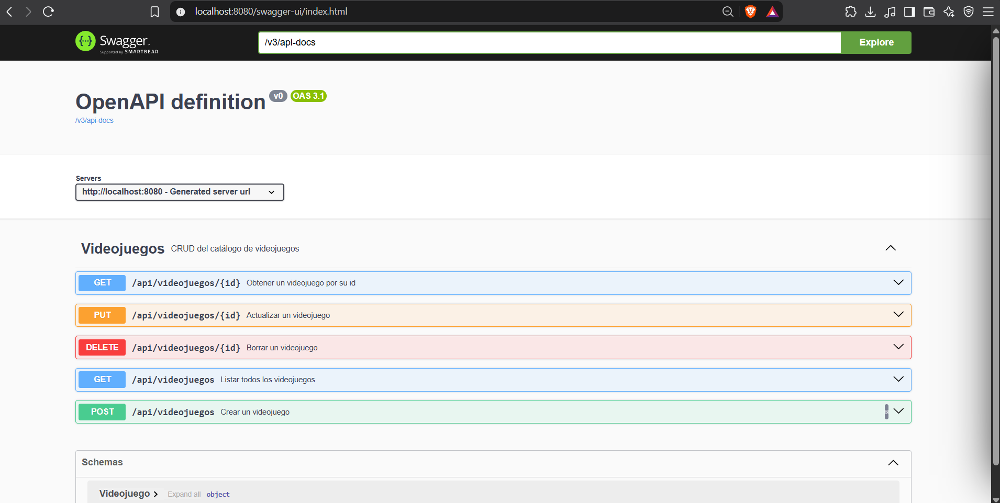
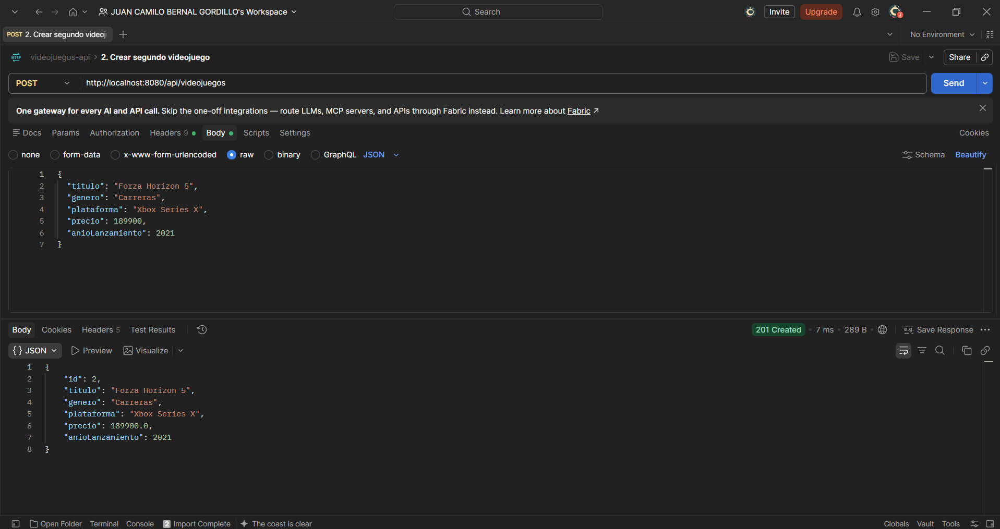
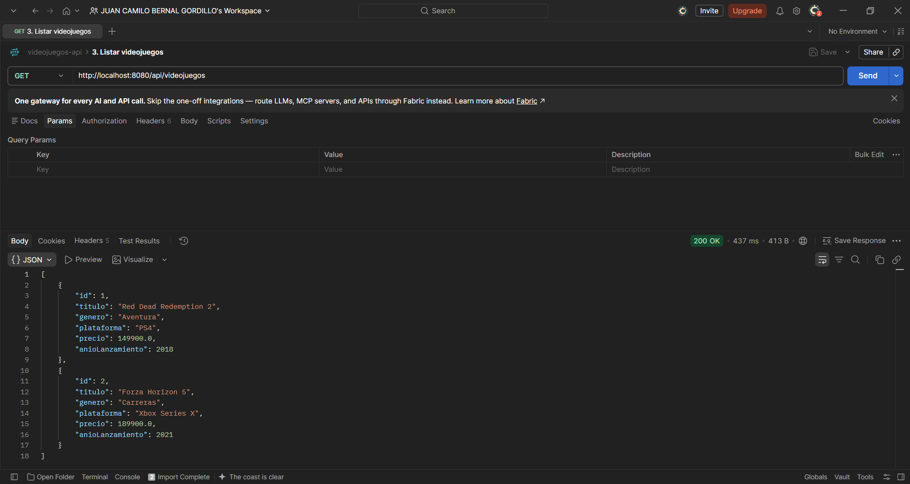
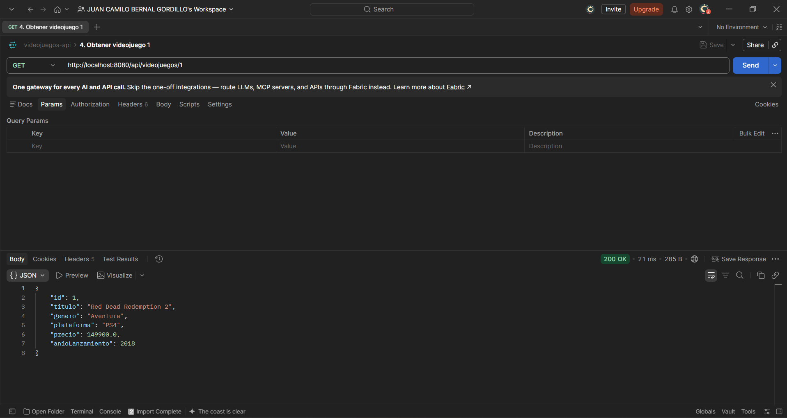
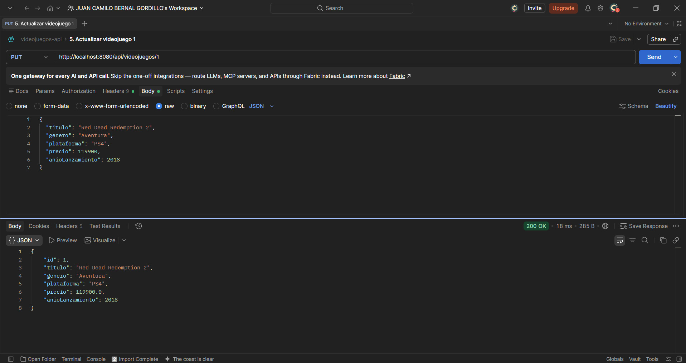
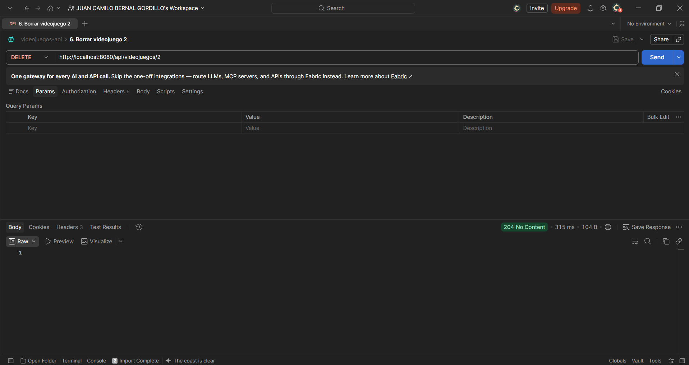
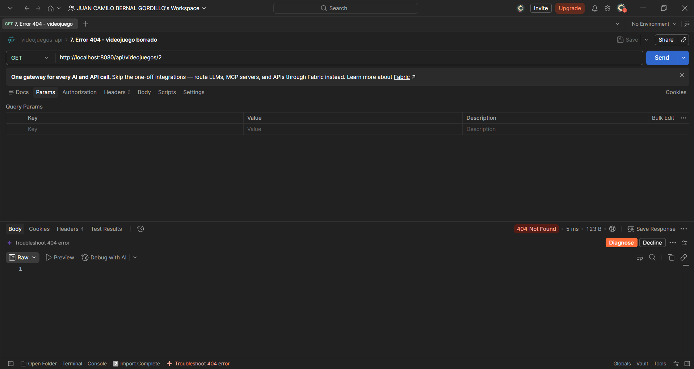

# Semana 10 · API probada — Catálogo de Videojuegos

| | |
| --- | --- |
| **Estudiante** | Juan Camilo Bernal Gordillo |
| **Materia** | Complementaria III - Profundización Desarrollo Fullstack (2026-B) |
| **Usuario de GitHub** | [JuanBernalCorhuila](https://github.com/JuanBernalCorhuila) |

Esta semana cerré el backend del catálogo de videojuegos. Reuní en un solo proyecto lo que fui construyendo durante el corte: la arquitectura en capas, la persistencia con JPA, el CRUD REST y la documentación con Swagger. Después volví a probar todos los endpoints con Postman, incluyendo un caso de error, para dejar la API lista para conectarla con un frontend.

El proyecto está hecho con Spring Boot (Java 17, Maven) y usa una base de datos H2 en memoria.

## 1. Estructura del proyecto

```
02-optional-activity/
├── README.md
└── videojuegos-api/
    ├── pom.xml
    ├── evidencias/                                  (capturas de Swagger y Postman)
    ├── postman/
    │   └── videojuegos-api.postman_collection.json  (colección con las pruebas)
    └── src/main/
        ├── java/com/corhuila/videojuegos/
        │   ├── VideojuegosApiApplication.java       (arranque de la aplicación)
        │   ├── model/Videojuego.java                (entity)
        │   ├── repository/VideojuegoRepository.java (repository)
        │   ├── service/VideojuegoService.java       (service)
        │   └── controller/VideojuegoController.java (controller)
        └── resources/application.properties         (configuración)
```

## 2. Las capas y la persistencia

Una petición entra por el controller, pasa al service, que usa el repository, y este guarda o consulta la entidad en la base de datos. Cada capa está en su propio paquete y tiene una sola responsabilidad:

- **Entity (`Videojuego`):** representa la tabla `videojuego`. Lleva `@Entity` para que JPA la guarde en la base de datos y `@Id` con `@GeneratedValue` para que el id lo asigne la base de datos.
- **Repository (`VideojuegoRepository`):** es una interfaz que extiende `JpaRepository`, así que ya trae los métodos para guardar, listar, buscar y borrar sin escribir SQL.
- **Service (`VideojuegoService`):** tiene la lógica de negocio. Antes de actualizar o borrar un videojuego revisa que exista.
- **Controller (`VideojuegoController`):** recibe las peticiones HTTP, llama al service y responde en JSON con el código de estado que corresponde. Nunca accede directamente al repository.

Por ejemplo, la decisión de si un videojuego se puede borrar la toma el service:

```java
public boolean eliminar(Long id) {
    if (!repo.existsById(id)) {
        return false;
    }
    repo.deleteById(id);
    return true;
}
```

Y el controller solo traduce ese resultado a un código HTTP:

```java
@DeleteMapping("/{id}")
public ResponseEntity<Void> borrar(@PathVariable Long id) {
    if (service.eliminar(id)) {
        return ResponseEntity.noContent().build();
    }
    return ResponseEntity.notFound().build();
}
```

Los datos se guardan con Spring Data JPA en H2. La configuración está en `application.properties`:

```properties
spring.datasource.url=jdbc:h2:mem:videojuegosdb
spring.jpa.hibernate.ddl-auto=create-drop
```

Al arrancar, JPA crea la tabla `videojuego` a partir de la entidad. Como H2 es en memoria no hay que instalar nada, pero los datos se reinician cada vez que se detiene la aplicación.

## 3. Cómo ejecutarla

Se necesita Java 17 o superior y Maven. Desde la carpeta `videojuegos-api`:

```bash
mvn spring-boot:run
```

Con la aplicación arriba quedan disponibles:

- La API: `http://localhost:8080/api/videojuegos`
- Swagger UI: `http://localhost:8080/swagger-ui.html`
- La descripción OpenAPI en JSON: `http://localhost:8080/v3/api-docs`

Para detenerla se presiona `Ctrl + C` en la terminal.

## 4. Endpoints

Todos los endpoints están bajo el recurso `/api/videojuegos`. La URL usa un sustantivo en plural y la acción la indica el método HTTP.

| Método | URL | Acción | Respuesta |
|---|---|---|---|
| GET | `/api/videojuegos` | Listar todos los videojuegos | `200 OK` |
| GET | `/api/videojuegos/{id}` | Obtener un videojuego | `200 OK` o `404 Not Found` si no existe |
| POST | `/api/videojuegos` | Crear un videojuego | `201 Created` |
| PUT | `/api/videojuegos/{id}` | Actualizar un videojuego | `200 OK` o `404 Not Found` si no existe |
| DELETE | `/api/videojuegos/{id}` | Borrar un videojuego | `204 No Content` o `404 Not Found` si no existe |

Para crear o actualizar se envía un JSON como este (el `id` no se envía, lo asigna la base de datos):

```json
{
  "titulo": "Red Dead Redemption 2",
  "genero": "Aventura",
  "plataforma": "PS4",
  "precio": 149900,
  "anioLanzamiento": 2018
}
```

## 5. Documentación con Swagger

La documentación la genera springdoc, que está como dependencia en el `pom.xml`:

```xml
<dependency>
    <groupId>org.springdoc</groupId>
    <artifactId>springdoc-openapi-starter-webmvc-ui</artifactId>
    <version>2.8.9</version>
</dependency>
```

Al arrancar, springdoc lee el controller y arma la documentación. En cada endpoint puse además una descripción corta y los códigos de respuesta, para que Swagger muestre lo mismo que realmente responde la API:

```java
@Operation(summary = "Obtener un videojuego por su id")
@ApiResponse(responseCode = "200", description = "Videojuego encontrado")
@ApiResponse(responseCode = "404", description = "No existe un videojuego con ese id", content = @Content)
@GetMapping("/{id}")
```

En `http://localhost:8080/swagger-ui.html` aparecen los cinco endpoints del recurso y, debajo, el esquema de `Videojuego`.



## 6. Pruebas con Postman

Probé los cinco endpoints siguiendo el ciclo completo del CRUD: creé dos videojuegos, los listé, consulté uno, lo actualicé, borré el otro y al final pedí el que había borrado para comprobar el caso de error. Las peticiones están guardadas en la colección `videojuegos-api/postman/videojuegos-api.postman_collection.json`, que se puede importar en Postman para repetirlas en el mismo orden.

**1. Crear un videojuego** — `POST /api/videojuegos` con los datos de Red Dead Redemption 2. Responde `201 Created` y devuelve el videojuego con `id: 1`.


**2. Crear un segundo videojuego** — `POST /api/videojuegos` con los datos de Forza Horizon 5. Responde `201 Created` con `id: 2`.



**3. Listar** — `GET /api/videojuegos` responde `200 OK` con los dos videojuegos registrados.



**4. Obtener uno** — `GET /api/videojuegos/1` responde `200 OK` con los datos del videojuego 1.



**5. Actualizar** — `PUT /api/videojuegos/1` cambia el precio de 149900 a 119900 y responde `200 OK` con los datos actualizados.



**6. Borrar** — `DELETE /api/videojuegos/2` responde `204 No Content`: el videojuego se borró y la respuesta no trae cuerpo.



**7. Caso de error** — `GET /api/videojuegos/2` responde `404 Not Found` y sin cuerpo, porque el videojuego 2 ya no existe. Así comprobé que el borrado funcionó y que la API avisa con el código correcto cuando se pide un recurso que no está.



Con esto la API queda con su CRUD completo, documentada y probada, lista para integrarla con el frontend.
